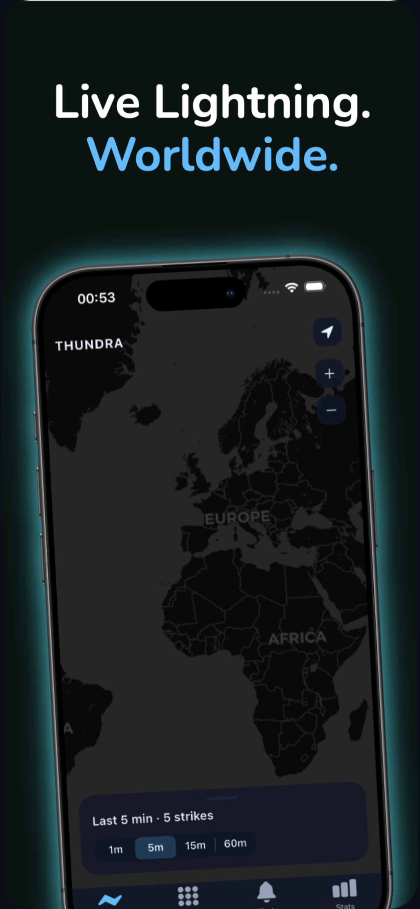
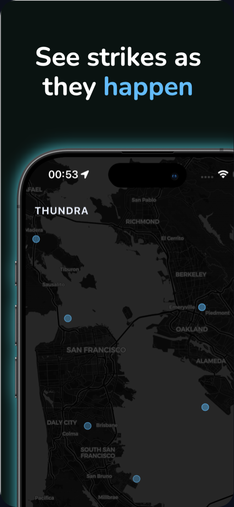
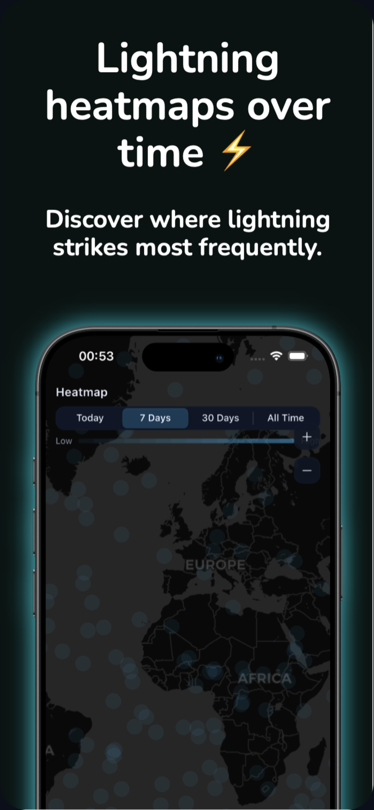
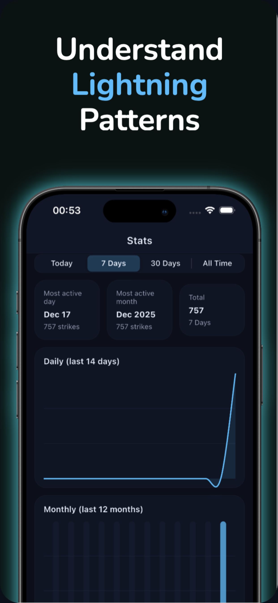
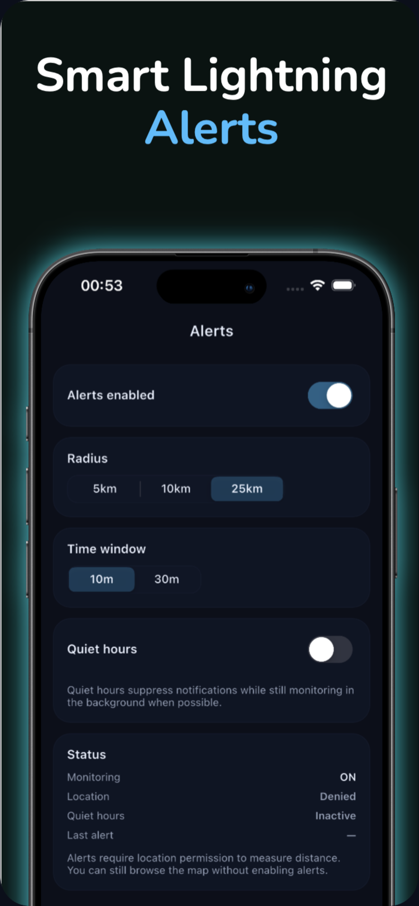

# THUNDRA — Global Lightning Tracker (iOS‑first)
Premium dark experience to watch the world’s lightning in real time, stay aware with calm alerts, and see where it strikes most.

## Why you’ll like it
- **Live, calming visuals:** Midnight navy canvas with electric blue strikes that fade naturally.
- **Awareness without panic:** Radius + window-based alerts, optional quiet hours, on-device notifications.
- **Insightful heatmaps:** Grid-based aggregation to show hot zones by day/week/month/all time.
- **Quick stats:** Daily trend line, monthly bars, most active day/month at a glance.
- **Privacy-conscious:** Location only when you allow it; data stays local (SQLite) with 30-day purge by default.

## Key Screens
| Live Map | Heatmap | Alerts | Stats | Overview |
| --- | --- | --- | --- | --- |
|  |  |  |  |  |

## Design Language
- Background: `#0B0F1A` (midnight navy), Accent: `#3ABEFF` (electric blue).
- Map is the hero; minimal chrome, iOS tab bar navigation.
- Subtle animations (fade/slide), rounded edges, calm copy throughout.

## Data & Alerts
- Mock lightning feed for offline-friendly use; provider is swappable for a live source later.
- Alerts run on-device: radius (5/10/25 km), window (10/30 min), optional quiet hours.
- No push servers; local notifications only when you enable them.

## Privacy Snapshot
- Uses your location only for centering and distance-based alerts.
- No accounts, no analytics SDKs, no ads. Local database; old strikes auto-purged (~30 days).
- Full policy: `docs/privacy-policy.md`
